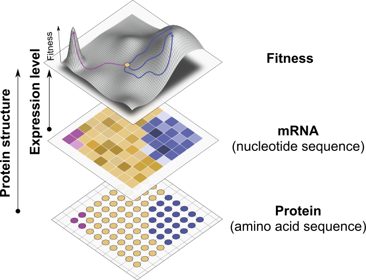

# GeneticFitness
## Introduction

Protein expression is often influenced by the choice of synonymous codons used to encode a protein. Bacteria, such as _E. coli_, exhibit a preference for certain synonymous codons over others, a phenomenon known as **synonymous codon bias**. Beyond codon bias, additional factors also impact protein expression. One such factor is the **secondary structure of messenger RNA (mRNA)**.

In this study, we explore how **RNA secondary structures** influence protein expression by integrating experimental data, codon composition, and predicted RNA structure. Specifically, we found a strong indication that mRNA secondary structure systematically affects the activity of the metabolic enzyme dihydrofolate reductase (DHFR), altering its activity by up to 50%. The enzymatic activity varies depending on the synonymous codons used and correlates with the predicted **minimum free energy (MFE)** of the mRNA structure.

To gain deeper mechanistic insights into how specific structural features of mRNA, such as loops, influence protein expression, we employ a **CNN-VAE deep neural network** (a combination of a convolutional neural network (CNN) and a variational autoencoder (VAE)). Our goal is to represent **mRNA secondary structures in a low-dimensional latent space**, identifying the key features that differentiate synonymous coding sequences with low and high expression levels.



## Credits

This is a fork from the repository [tochsner/GeneticFitness](https://github.com/tochsner/GeneticFitness) by Tobia Ochsner who performed the initial analysis.

## Installation and usage

To install and set up this repository, follow the steps below.

### 1. Clone the Repository
First, clone the repository from GitHub:
```sh
git clone https://github.com/aapsonn/GeneticFitness
cd GeneticFitness
```

### 2. Make sure you have `poetry` installed

### 3. Set up the environment and install the dependencies

```sh
poetry install
pre-commit install

```

### 4. Prepare the data and run the training

```sh
poetry run python src/run.py

```

